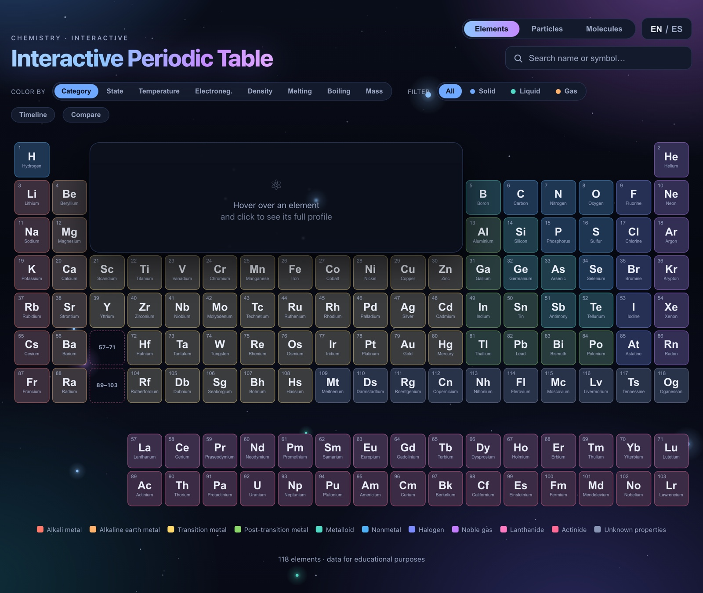

# Interactive Periodic Table

An interactive, bilingual (EN/ES) periodic table that also explores the Standard
Model of particle physics and a small catalog of 3D molecules — a static web
page with **no build step and no dependencies**.

**Live:** https://supernovaia.github.io/periodic-table/



## Features

- **118 elements** with a full detail panel: real photo, generated Bohr diagram,
  properties, oxidation states and electron configuration.
- **Three views** from one switch:
  - **Elements** — the periodic table.
  - **Particles** — the 17 particles of the Standard Model.
  - **Molecules** — 16 molecules (inorganic, organic, biomolecules, drugs) in a
    hand-drawn 3D *ball-and-stick* viewer (canvas, no libraries): autorotates and
    you can drag to rotate.
- **Color by** category, physical state, temperature, electronegativity, density,
  melting point, boiling point or atomic mass (heatmaps with a gradient legend).
- **Temperature slider** — recolors every element by its state at the chosen
  temperature, and the **solid / liquid / gas filter follows the slider** (not
  just room temperature).
- **Discovery timeline** — dim the elements discovered after a given year.
- **Compare mode** — put elements side by side.
- **Search** by name (EN/ES), symbol or atomic number.
- **Deep links** — the URL hash reflects what is open (`#Fe`, `#26`, `#caffeine`),
  with a *Copy link* button.
- **Bilingual EN/ES**, English by default.
- **Responsive**, works on mobile.

## Running it

It is a plain static site — just open the file:

```sh
open index.html
```

Or serve the folder with any static server (e.g. `python3 -m http.server`) and
visit `http://localhost:8000`. Deployment is GitHub Pages straight from `main`.

## Project structure

| File / folder     | Responsibility                                                        |
|-------------------|-----------------------------------------------------------------------|
| `index.html`      | Structure and containers (table, panel, language switch).             |
| `styles.css`      | Styles, dark theme and per-category color tokens.                     |
| `data.js`         | The 118 elements + UI strings (single source of truth).               |
| `particles.js`    | Standard Model: 17 particles, categories and view texts.              |
| `molecules.js`    | 3D molecules: catalog, categories, tags and texts.                    |
| `images.js`       | Atomic number → photo (`images/…`) map + license credit.              |
| `app.js`          | Table render, filters, panel, i18n, Bohr diagrams and 3D viewer.      |
| `tools/`          | Maintenance scripts (e.g. importing molecules from PubChem).          |
| `images/`         | Element photos (resized, from Wikimedia Commons).                     |

All user-facing text lives in `data.js` (and the per-view UI objects) as `{ en, es }`
pairs, so the app stays fully bilingual. See [`CLAUDE.md`](CLAUDE.md) for the
detailed conventions and development workflow.

## Credits & licensing

- Element data is provided for **educational purposes**.
- **Element photos** come from Wikimedia Commons / images-of-elements.com, mostly
  under **CC BY 3.0**. Every photo's attribution is listed in
  [`ATTRIBUTIONS.md`](ATTRIBUTIONS.md) as required by the licenses.
- **Molecule 3D conformers** come from **PubChem** (public domain).
- Bohr diagrams are generated from the atomic number — they are not assets.

No formal license has been set for the source code; please ask before reusing it.
